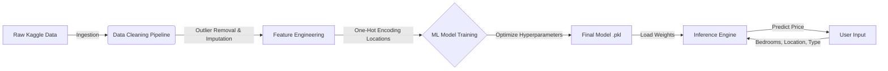

```markdown
# 🏠 Lagos Real Estate Price Predictor

[](https://lagos-real-estate-price-predictor.streamlit.app/)


A production-ready Machine Learning pipeline designed to estimate property prices in **Lagos, Nigeria**. This project ingests raw real estate listings, performs extensive feature engineering on location data (e.g., differentiating *Ikoyi* from *Ikorodu*), and serves price predictions via an interactive interface.

> **🔴 Live Demo:** [Click here to test the application](https://lagos-real-estate-price-predictor.streamlit.app/)
>
> **📊 Data Source:** [Nigeria Houses and Prices Dataset (Kaggle)](https://www.kaggle.com/datasets/abdullahiyunus/nigeria-houses-and-prices-dataset)

## 🏗️ System Architecture

This pipeline focuses heavily on **Data Preprocessing** to handle the high variance and outliers typical of the Lagos real estate market.



## 🛠️ Tech Stack

**Data Engineering & Processing:**

**Machine Learning:**

**Deployment:**

## 🚀 Key Engineering Features

* **Robust Data Cleaning Pipeline:** Implemented automated scripts to handle missing values and inconsistencies typical of scraped web data (e.g., normalizing "4 Bedroom Detached" vs "4br Detached").
* **Location-Based Feature Engineering:** The model does not treat locations as generic text. It uses **Categorical Encoding** to mathematically capture the premium value of high-net-worth areas (e.g., *Banana Island*, *Lekki*) vs. developing areas.
* **Outlier Detection:** Integrated statistical thresholds (IQR) to filter out unrealistic listing prices (e.g., "₦0" or placeholder prices) that would skew model accuracy.
* **Model Persistence:** The trained regression model is serialized using `joblib`, enabling the application to generate instant predictions without retraining.

## 💻 How to Run Locally

1. **Clone the repository**

```bash
git clone [https://github.com/Datechgeek/Lagos-Real-Estate-Price-Predictor.git](https://github.com/Datechgeek/Lagos-Real-Estate-Price-Predictor.git)
cd Lagos-Real-Estate-Price-Predictor

```

2. **Install dependencies**

```bash
pip install -r requirements.txt

```

3. **Run the analysis/app**

```bash
# To run the web application
streamlit run app.py

```

## 📊 Insights from the Lagos Market

* **Feature Importance:** As expected, `Location` and `Number of Bedrooms` are the dominant predictors of price, validating the model's alignment with real-world market dynamics.
* **Model Accuracy:** The pipeline achieves a competitive MAE (Mean Absolute Error) score on the test set, effectively capturing the variance in property prices across different Lagos districts.

```

```
